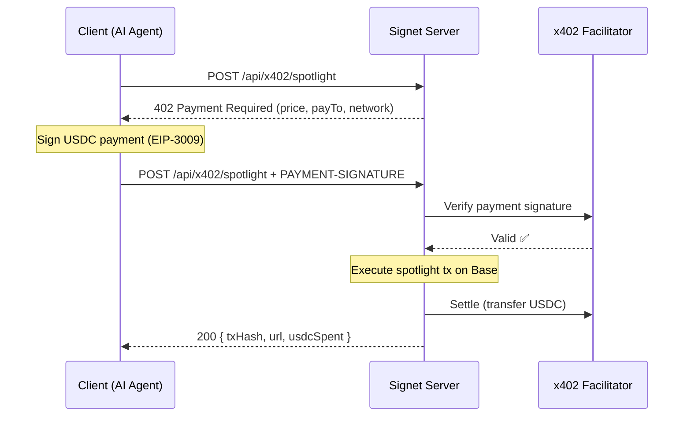

# Signet Client

Tools for interacting with [Signet](https://signet.sebayaki.com) — onchain advertising on [Hunt Town](https://hunt.town).

## Quick Start

```bash
# Install CLI globally
npm install -g @signet-base/cli

# Or run directly with npx
npx @signet-base/cli estimate
npx @signet-base/cli list
npx @signet-base/cli post --url https://example.com --simulate
```

### For AI Agents (OpenClaw / ClawHub)

```bash
clawhub install signet
```

## What's Inside

| Directory | Description |
|-----------|-------------|
| [`cli/`](./cli) | CLI tool — `signet list`, `signet estimate`, `signet post` |
| [`x402-example/`](./x402-example) | x402 payment protocol integration example |
| [`agent-skill/`](./agent-skill) | AI agent skill for [ClawHub](https://clawhub.com) |

## CLI Commands

```bash
# List recent spotlight signatures (reads directly from Base chain)
signet list
signet list -n 10

# Estimate USDC cost for spotlight placement
signet estimate
signet estimate --hours 6

# Post a URL to spotlight via x402 payment
signet post --url https://example.com --hours 0 --simulate   # dry run
signet post --url https://example.com --hours 0              # real post (needs PRIVATE_KEY)
```

All read operations (`list`, `estimate`) go directly to the SignetV2 contract on Base — no API server needed.

## What is Signet?

Signet is an onchain advertising protocol on Base. Anyone can place a URL on the spotlight by paying HUNT tokens (or USDC/ETH via zap). The spotlight slot can be guaranteed for up to 24 hours.

- **Advertise on-chain** — URLs are stored onchain with bonding curve economics
- **HUNT-backed** — All ad spend flows through HUNT token via Mint Club bonding curves
- **AI-native** — x402 payment protocol enables AI agents to buy ad slots programmatically

## x402 Payment Flow



## Links

- [Signet App](https://signet.sebayaki.com)
- [npm: @signet-base/cli](https://www.npmjs.com/package/@signet-base/cli)
- [ClawHub: signet](https://clawhub.com/skills/signet)
- [Hunt Town Docs](https://docs.hunt.town)
- [x402 Protocol](https://www.x402.org)
